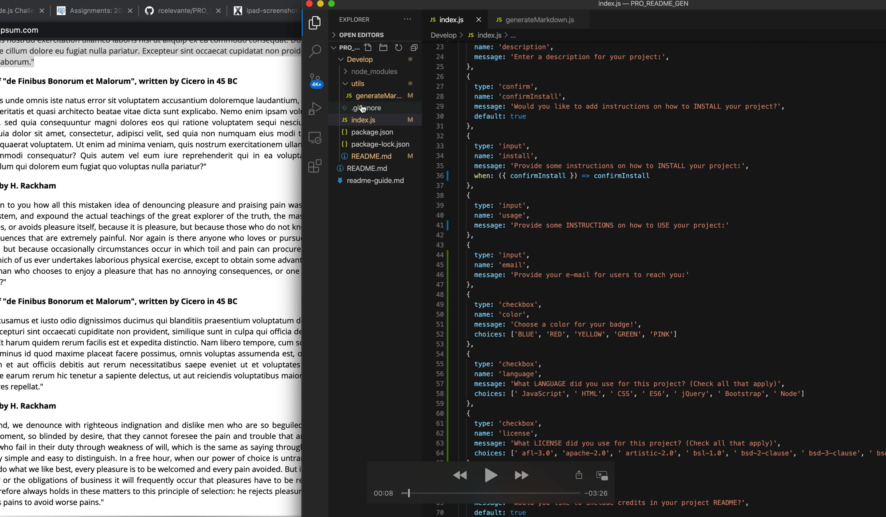

# PRO_README_GEN
An app that generates a professional README page for their repository.
It will ask the user to enter some details needed and the app will format it for you! Easy as that!

*Will be using a vanilla javascript with node.js!*

[How to create a Professional README]*(./readme-guide.md)*

# USER STORY
AS A developer
I WANT a README generator
SO THAT can quickly create a professional README for a new project

__GIVEN__ a command-line application that accepts user input

__WHEN__ I am prompted for information about my application repository

__THEN__ a high-quality, professional README.md is generated with the title of my project and sections entitled Description, Table of Contents, Installation, Usage, License, Contributing, Tests, and Questions

__WHEN__ I enter my project title

__THEN__ this is displayed as the title of the README

__WHEN__ I enter a description, installation instructions, usage information, contribution guidelines, and test instructions

__THEN__ this information is added to the sections of the README entitled Description, Installation, Usage, Contributing, and Tests

__WHEN__ I choose a license for my application from a list of options

__THEN__ a badge for that license is added near the top of the README and a notice is added to the section of the README entitled License that explains which license the application is covered under

__WHEN__ I enter my GitHub username

__THEN__ this is added to the section of the README entitled Questions, with a link to my GitHub profile

__WHEN__ I enter my email address

__THEN__ this is added to the section of the README entitled Questions, with instructions on how to reach me with additional questions

__WHEN__ I click on the links in the Table of Contents

__THEN__ I am taken to the corresponding section of the README

# Video

# Usage
It will prompt user to input their answers about their project. When user finishes through the questions, it will generate a README file.

# Credits
Credits to Rochelle Ruiz! That's me! I did this project! I lost a bunch of my commits. I nearly lost all my codes due to trying to push the repo with a large file(video). I decided to delete the video out of the folder and pushed it back but the commit has teh video attached to it. I did some git commands which deleted all my codes. Finally we got it back and did it the cleanest way possible.

# License
MIT
